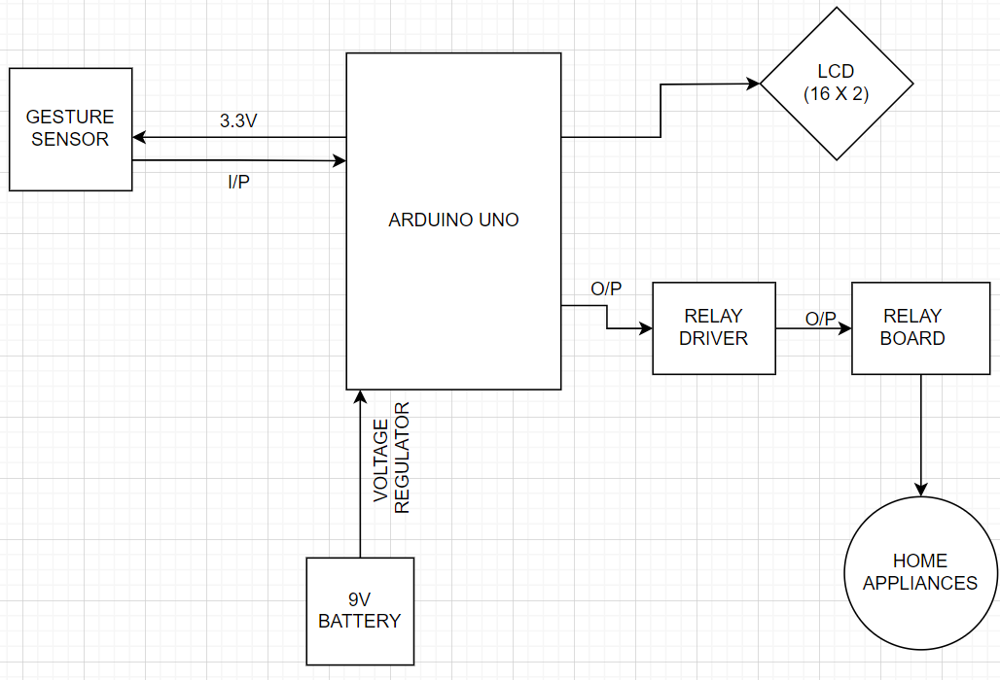

# 🔌 Smart Gesture-Controlled Switch System using IoT

## 🎯 Objective

To enable users to control electronic devices through automatic hand gestures, providing a convenient and hands-free interface for managing various functionalities.

---

## 🧠 How It Works

- 👋 **Gesture Input**:
  - UP → Turn ON devices
  - DOWN → Turn OFF devices
  - LEFT/RIGHT → Toggle individual relays
- 🔁 **Relay Control**: Relays activate/deactivate appliances based on gesture detection.
- 📟 **LCD Feedback**: Displays current gesture status.
- 🔊 **Buzzer**: Emits sound when gesture is detected.

---

## 🧰 Hardware Requirements

| Component        | Description                |
| ---------------- | -------------------------- |
| Arduino Uno      | Main microcontroller       |
| APDS-9960 Sensor | Detects gesture directions |
| 16x2 LCD Display | For user interaction       |
| 5V Relay Module  | Controls AC/DC loads       |
| Buzzer           | Provides auditory feedback |

---

## 💻 Software Requirements

- Arduino IDE
- [Adafruit_APDS9960 Library](https://github.com/adafruit/Adafruit_APDS9960)
- LiquidCrystal Library

---

## 🧾 Arduino Code

The Arduino sketch is located in the `main.ino` file. Upload it using Arduino IDE.

---

## 📊 Block Diagram / Flowchart



_(Replace with actual image in assets folder)_

---

## ✅ Result

- **Upward Gesture** ➜ All appliances **ON**
- **Downward Gesture** ➜ All appliances **OFF**
- **Finger near sensor** ➜ LCD: `Initializing gesture`
- **Finger far from sensor** ➜ LCD: `Gesture timeout`

---

## 🏁 Conclusion

An IoT-based gesture-controlled switch promotes contactless interaction, ideal for smart homes. It's practical, eco-friendly, and enhances safety.

---

## 📁 Project Structure

```
Smart-Gesture-Controlled-Switch/
├── main.ino
├── README.md
├── assets/
│   ├── demo.gif
│   └── flowchart.png
├── docs/
│   └── Smart Gesture-controlled Switch System using IoT.pptx
├── LICENSE
└── .gitignore
```
